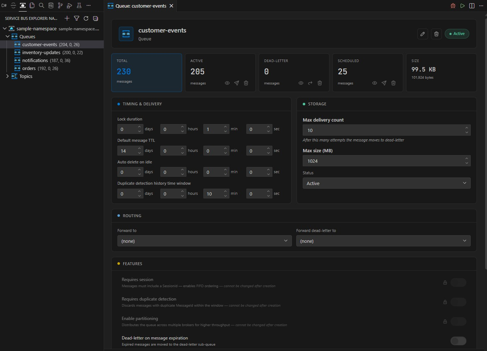
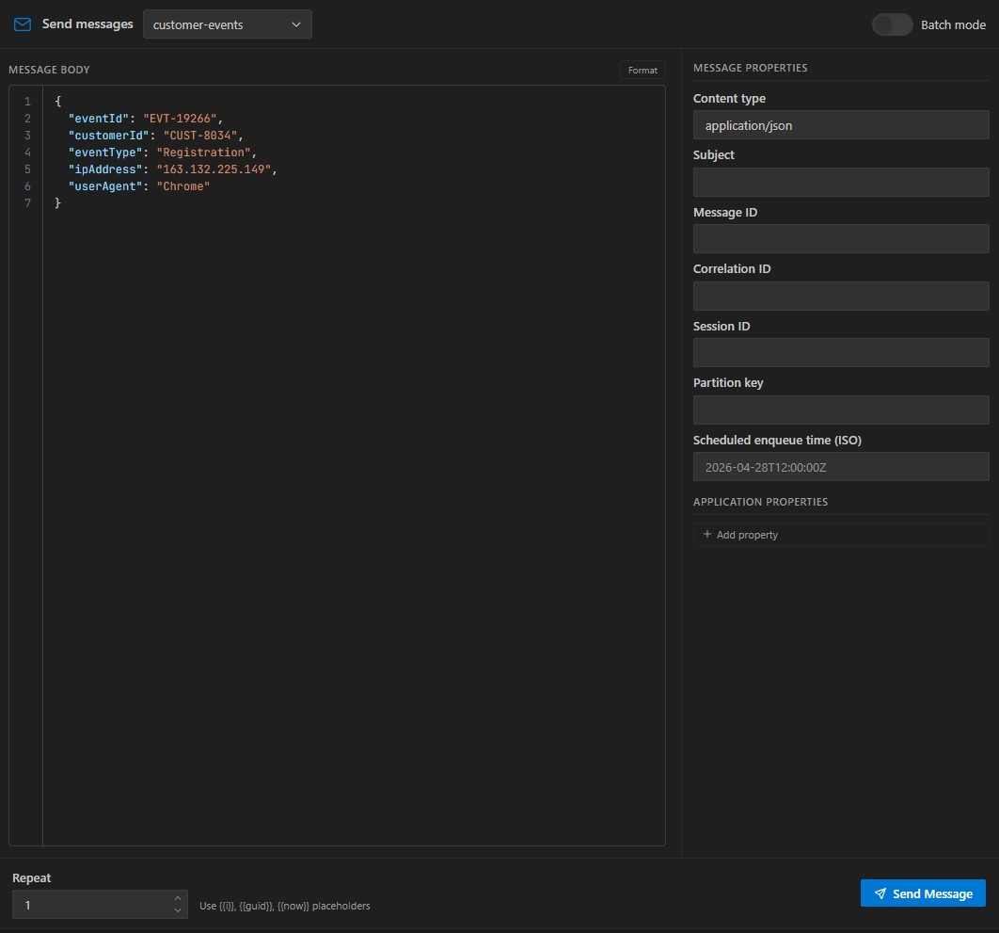
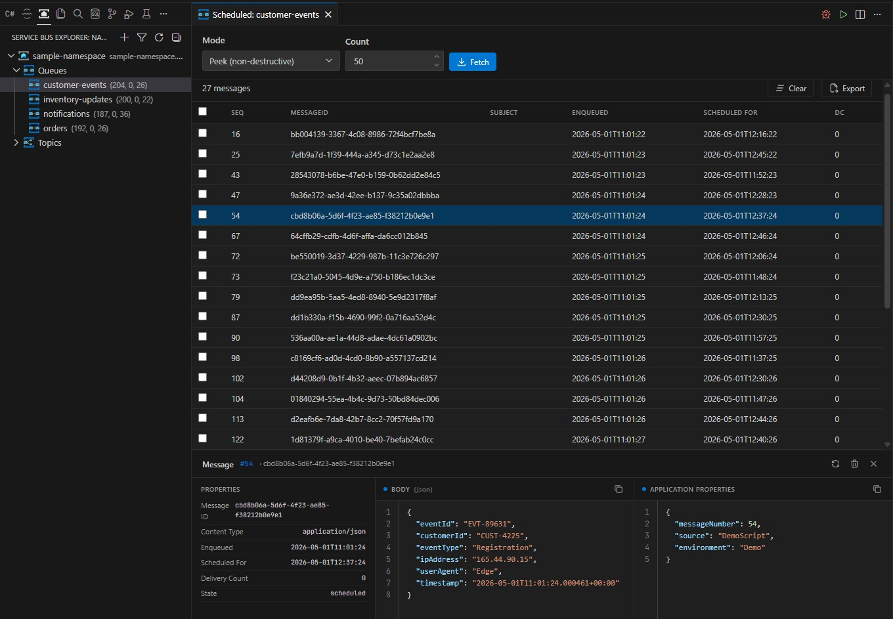

# Azure Service Bus Explorer for VS Code

A lightweight Azure Service Bus client that allows you to manage queues, topics, subscriptions, and messages directly from Visual Studio Code. This extension provides a modern alternative to the classic Service Bus Explorer, built with the latest Azure SDKs and designed for seamless integration into your development workflow.

## Features

### Namespace Management
Connect to Azure Service Bus namespaces using connection strings or Azure authentication. Browse and manage all your queues, topics, and subscriptions in a unified tree view.

### Queue and Topic Operations
Create, configure, and delete queues and topics with full control over their properties. View detailed statistics including message counts, entity status, and configuration settings.

### Message Management
Send messages to queues and topics with support for custom properties, scheduled delivery, and sessions. View, receive, and delete messages with an intuitive interface that makes message handling straightforward.

### Scheduled Messages
Manage scheduled messages with the ability to view all pending scheduled deliveries and cancel them when needed. Perfect for handling deferred operations and time-based messaging patterns.

### Advanced Features
- Dead letter queue management
- Message purging for bulk operations
- Import and export functionality for messages
- Subscription rules and filters
- Real-time message listening
- Session support

## Getting Started

1. Install the extension from the VS Code marketplace
2. Open the Service Bus view from the activity bar
3. Add a namespace using either a connection string or Azure credentials
4. Start managing your queues, topics, and messages

## Authentication

The extension supports two authentication methods:

- **Connection String**: Quick access using a namespace connection string
- **Azure Authentication**: Secure authentication using your Azure credentials via `@azure/identity`

## Development

### Prerequisites
- Node.js 18 or later
- VS Code

## Requirements

- Azure Service Bus namespace (Standard or Premium tier recommended for full feature support)
- Valid Azure credentials or connection string
